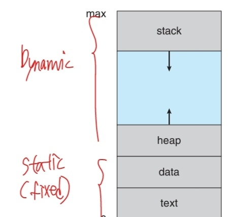
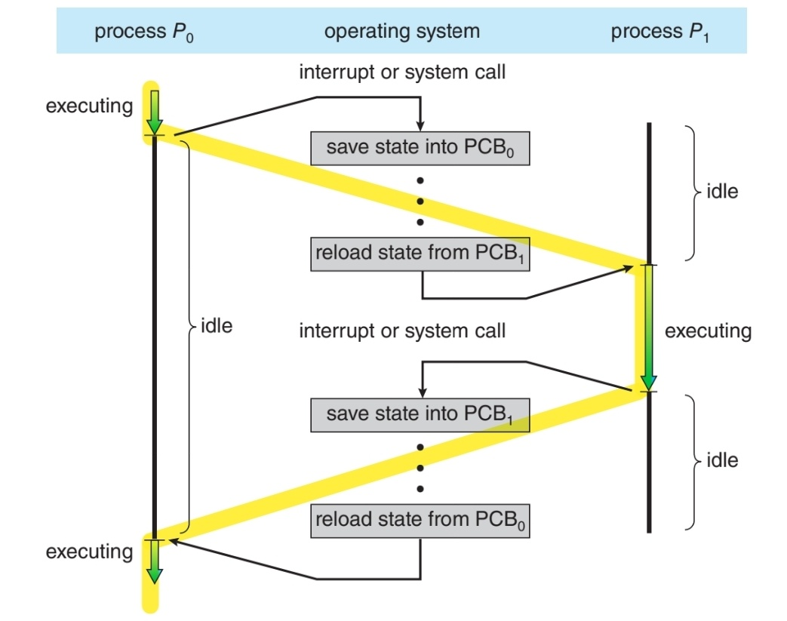

# [Chapter 3] Processes

* Process : 실행중인 프로그램. 현대 컴퓨터 시스템에서 작업의 단위를 의미함.
* Program : 스토리지에 저장된 executable file. 이게 메모리에 로드 되면 하나의 프로세스가 된다고 이해하면 될 것 같다

## 3.1 Process Concept

### - Process Memory Layout

  
    - stack : 함수가 실행될 때 parameter, return address, local varible 등이 저장됨
    - heap : 프로그램 런타임동안 동적으로 관리되는 메모리 영역
    - text : Executable code, CPU에 전달 될 instruction이 저장된 영역
    - data : global variable, jump table 등(data)이 저장된 영역

* Dynamic (stack, heap) 영역은 상황에 따라 계속 변하지만 Static (text, data) 영역은 Executable file에서 그대로 메모리에 로드된다.

### - Process State
* 프로세스 상태는 크게 5가지로 구분됨
  * New : 프로세스가 생성되고 있음
  * Running : CPU에서 instruction이 실행되고 있음
  * Wating : 입출력과 같은 특정 이벤트가 일어나기 전까지 대기
  * Ready : CPU를 할당받기 위해 대기
  * Terminated : 실행이 끝남

### - PCB (Process Control Block)
* OS가 프로세스를 관리하기 위해 프로세스에 대한 정보(PCB)를 관리함
* PCB에 저장된 주 내용은
  * Process state
  * PC (Program Counter) : CPU가 다음으로 실행할 명령의 주소 (text 메모리의 한 곳)
  * CPU registers : 프로세스가 끝나기 전에 CPU를 양보/빼앗기게 될 때 (context switch) 현재 실행중인 정보(register 값)를 저장 해둬야 나중에 다시 이어서 실행을 할 수 가 있게 된다.
  * 이 외에도 CPU-scheduling, Memory-management, Accounting, I/O 관련 정보 등이 있다.

## 3.2 Process Scheduling
* Multiprogramming의 목적 : CPU utilization(이용률)을 최대한 높이는 것이다.
* 일반적으로 process를 **I/O-bound Process**와 **CPU-bound Process**로 구분한다
  * I/O-bound : CPU 연산을 쓰는 시간 보다 입출력에 소모되는 시간이 더 많은 프로세스
  * CPU-bound : CPU 연산을 쓰는 시간이 더 많은 프로세스
  * ex) 사용자가 입력을 하는 시간이 초단위인데, CPU는 1초에 20억 클럭을 돌릴 수 있다(2.0GHz 기준). 이러한 입출력에 시간을 소모하는 동안 프로세스가 CPU를 점유하고 있다면 그만큼의 utilization 저하가 일어나고 있다는 뜻!

### - Context Switch
* 인터럽트가 발생하면 이를 처리하기 위해 OS가 CPU에서 실행중인 작업을 중단하고 커널 루틴을 실행시킨다.
* 이 때 중단된 작업은 나중에 다시 실행되어야 하기 때문에 현재의 context(PCB)를 저장한 후에 다시 실행될 때 복구를 해주어야 한다.

* Context switch에서 PCB를 저장하고 불러오는 과정은 CPU를 프로세스 실행에 사용하는 것이 아니라 프로세스를 교체하는 작업이기 때문에 CPU utilization 관점에서는 무의미한 일이다.

* 이걸 최소화 하는 방법은 
  * Context switch의 수를 줄이기 (적절한 스케줄링 알고리즘)
  * Context switch time을 줄이기
    * 특히 하드웨어와 굉장히 연관이 있는데, CPU 프로세서의 레지스터 셋의 크기가 가장 큰 영향을 미친다. 레지스터 셋이 클수록 PCB를 업데이트 하는데 소모되는 시간이 많다.