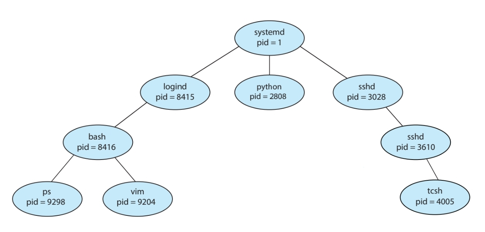
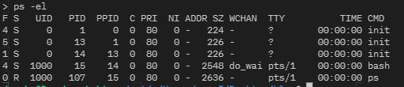

<link rel="stylesheet" type="text/css" href="../../css/theme.css">

# [Chapter 3] Processes

* Process : 실행중인 프로그램. 현대 컴퓨터 시스템에서 작업의 단위를 의미함.
* Program : 스토리지에 저장된 executable file. 이게 메모리에 로드 되면 하나의 프로세스가 된다고 이해하면 될 것 같다

## 3.1 Process Concept

### - Process Memory Layout

  
    - stack : 함수가 실행될 때 parameter, return address, local varible 등이 저장됨
    - heap : 프로그램 런타임동안 동적으로 관리되는 메모리 영역
    - text : Executable code, CPU에 전달 될 instruction이 저장된 영역
    - data : global variable, jump table 등(data)이 저장된 영역

* Dynamic (stack, heap) 영역은 상황에 따라 계속 변하지만 Static (text, data) 영역은 Executable file에서 그대로 메모리에 로드된다.

### - Process State

* 프로세스 상태는 크게 5가지로 구분됨
  * New : 프로세스가 생성되고 있음
  * Running : CPU에서 instruction이 실행되고 있음
  * Wating : 입출력과 같은 특정 이벤트가 일어나기 전까지 대기
  * Ready : CPU를 할당받기 위해 대기
  * Terminated : 실행이 끝남

### - PCB (Process Control Block)

* OS가 프로세스를 관리하기 위해 프로세스에 대한 정보(PCB)를 관리함
* PCB에 저장된 주 내용은
  * Process state
  * PC (Program Counter) : CPU가 다음으로 실행할 명령의 주소 (text 메모리의 한 곳)
  * CPU registers : 프로세스가 끝나기 전에 CPU를 양보/빼앗기게 될 때 (context switch) 현재 실행중인 정보(register 값)를 저장 해둬야 나중에 다시 이어서 실행을 할 수 가 있게 된다.
  * 이 외에도 CPU-scheduling, Memory-management, Accounting, I/O 관련 정보 등이 있다.

## 3.2 Process Scheduling

* Multiprogramming의 목적 : CPU utilization(이용률)을 최대한 높이는 것이다.
* 일반적으로 process를 **I/O-bound Process**와 **CPU-bound Process**로 구분한다
  * I/O-bound : CPU 연산을 쓰는 시간 보다 입출력에 소모되는 시간이 더 많은 프로세스
  * CPU-bound : CPU 연산을 쓰는 시간이 더 많은 프로세스
  * ex) 사용자가 입력을 하는 시간이 초단위인데, CPU는 1초에 20억 클럭을 돌릴 수 있다(2.0GHz 기준). 이러한 입출력에 시간을 소모하는 동안 프로세스가 CPU를 점유하고 있다면 그만큼의 utilization 저하가 일어나고 있다는 뜻!

### - Context Switch

* 인터럽트가 발생하면 이를 처리하기 위해 OS가 CPU에서 실행중인 작업을 중단하고 커널 루틴을 실행시킨다.
* 이 때 중단된 작업은 나중에 다시 실행되어야 하기 때문에 현재의 context(PCB)를 저장한 후에 다시 실행될 때 복구를 해주어야 한다.

* Context switch에서 PCB를 저장하고 불러오는 과정은 CPU를 프로세스 실행에 사용하는 것이 아니라 프로세스를 교체하는 작업이기 때문에 CPU utilization 관점에서는 무의미한 일이다.

* Context switch에 의한 loss를 최소화 하는 방법은
  * Context switch의 수를 줄이기 (적절한 스케줄링 알고리즘)
  * Context switch time을 줄이기
    * 특히 하드웨어와 굉장히 연관이 있는데, CPU 프로세서의 레지스터 셋의 크기가 가장 큰 영향을 미친다. 레지스터 셋이 클수록 PCB를 업데이트 하는데 소모되는 시간이 많다.

## 3.3 Operations on Processes

### - Process Creation

* 대부분의 시스템에서 프로세스는 integer 형태의 고유값인 pid로 구분된다.
* 시스템이 부트되면 제일 처음으로 systemd(or init)이라는 프로세스가 pid = 1 로 실행된다. 이 프로세스는 모든 user process의 parent가 된다.

* Linux 터미널에서 ps -el 명령을 입력하면 프로세스 리스트를 얻을 수 있다.

* Parent 프로세스가 child 프로세스를 생성할 때 결정되어야 할 내용
  * child와 동시에 실행(e.g. bash> background) / child가 끝날 때까지 대기(e.g. bash> foreground)
  * child가 parnet의 address-space를 복사(e.g. fork()) / 새로운 프로그램을 로드 (e.g. exec())

### - Process Termination

* 프로세스 종료의 원인
  * 마지막 statement 실행 완료
  * exit() system call로 OS에 요청
  * parent 프로세스가 kill
    * child가 특정 리소스를 너무 많이 차지 하는 경우
    * child에 할당된 task가 필요없어진 경우
    * parent가 종료되는 경우(cascading termination)
  
* 프로세스가 종료가 되면
  * 대기중인 parent 프로세스에 status value를 리턴
  * 메모리, open file, I/O buffer 등이 회수됨

## 3.4 IPC (InterProcess Communication)

* 일반적으로 프로세스는 고유한 address-space를 가지고 있으며 다른 프로세스가 접근할 수 없다.

* Process cooperation의 이유
  * Information Sharing : ex) Chrome에서 복사한 내용을 Word에 붙여넣기
  * Computaion Speedup : 멀티코어 환경에서 task의 빠른 처리를 위해 여러 subtask로 분할
  * Modularity : System function들을 분리된 프로세스/스레드에서 실행

* IPC model
  * **Shared memory** : 말 그대로 특정 메모리 영역을 다른 프로세스와 공유. shared region을 만들 때만 system call을 하므로 context switch overhead가 적다.
  * **Message passing** : system call을 통해 프로세스간 메세지를 교환. 메세지를 보낼 때마다 system call을 하니 overhead가 높겠지?

  

## 3.5 IPC in Shared-Memory Systems

  * 일반적으로는 공유 메모리 영역을 create하는 process의 address space에 존재한다.
  * 여러 프로세스가 동시에 쓰기를 하면 안되므로 synchronization이 필요.
  * Application programmer가 명시적으로 구현해야 한다.

## 3.6 IPC in Message-Passing Systems

  * fixed-sized / variable-sized
    * fixed : System-level implementation이 간단. 그러나 user-level 프로그래밍이 힘들다
    * variable : System-level이 복잡하나 user-level은 심플하다

  * 메제지를 주고 받기 위해서는 프로세스간 **Communication link**가 있어야 한다.
  * 이 방식의 구현 방법은
    * **Naming** : Direct / Indirect communication
    * **Synchronization**: Synchronous / Asynchronous communication
    * **Buffering** : Automatic / Explicit buffering 으로 구분된다.

### - Naming
  * **Direct communication** : 수신/발신 프로세스가 명시됨
    * send(P, message) : 프로세스 P에 message를 전송
    * receive(Q, message) : 프로세스 Q로부터 message를 수신

  * Direct communication에서 communication link의 특징
    * 수신/발신자가 명시되어 있기 때문에 link가 자동적으로 생긴다.
    * Link는 1:1이다.
    * 한 쌍의 프로세스 간에는 딱 하나의 link만 있을 수 있다.

  * Direct communication의 단점
    * Limited modularity : Process identifier가 바뀌게 되면 관련 링크를 모두 수정해야함

 

  * **Indirect communication** : 메세지가 *mailbox*를 통해 전달됨
    * send(A, message) : mailbox A로 message를 전송
    * receive(A, message) : mailbox A로부터 message를 수신

  * Inirect communication에서 communication link의 특징
    * 두 프로세스가 같은 mailbox를 가지고 있어야만 link가 된다.
    * Link 하나에 여러 프로세스가 관련될 수 있다.
    * 공유된 mailbox가 여러개라면 한 쌍의 프로세스간에도 여러 링크가 생길 수 있다.

  * 이러한 특징으로 인해 한 mailbox에 3개 이상의 process가 link되면 의도치 않은 communication이 발생할 수 있다.
    * 이를 해결하기 위한 방법은
      * 한 link에 최대 2개의 프로세스만 허용
      * 한번에 한 프로세스만 receive() operation을 할 수 있게 함
      * 어떤 프로세스가 receive할지 정함

  * Mailbox의 소유권
    * 특정 프로세스 / OS system
    * 소유권이 특정 프로세스에 있다 : 소유자가 receive, 사용자가 send하면 되므로 No confusion!
    * mailbox가 OS system에 의해 관리된다면 다음과 같은 mailbox manage mechanism을 제공해야함
      * Mailbox creation
      * Send / Receive message
      * Mailbox deletion

### - Synchronization

  * Synchronous (blocking) / Asynchronous (nonblocking)
  1. Blocking send : 메세지를 보낸 후 메세지가 프로세스(또는 mailbox)에 수신이 될 때까지 대기
  2. Nonblocking send : 메세지를 보내고 하던것 계속 진행(수신 여부 확인 x)
  3. Blocking receive : 수신할 메세지가 생길 때까지 대기
  4. Nonblocking receive : 수신할 메세지가 존재하는지, 유효한지를 확인

### - Buffering
  
  * 보통 메세지를 주고받을 때 임시 저장소인 버퍼가 있어야 한다. 이 때 버퍼의 사이즈에 따른 방식이 구분된다.
  1. Zero capacity : 버퍼가 없음. 무조건 blocking send가 이루어져야함
  2. Bounded capacity : 버퍼 크기만큼의 메세지만 있을 수 있다. 버퍼가 비어있다면 nonblocking send가 가능하지만 버퍼가 꽉 찼다면 버퍼에 공간이 생길 때 까지 sending이 block 되어야 한다.
  3. Unbounded capacity : Sender never blocks.

 

### Reference
* Operating System Concepts 10th edition